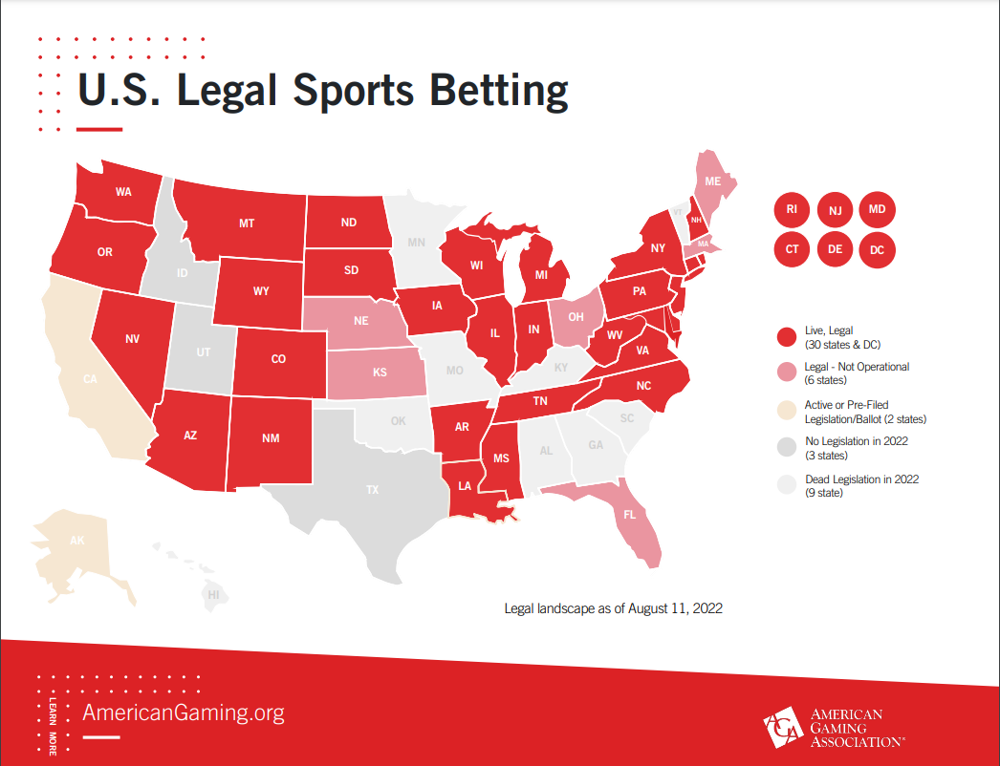

# MLB Betting Model
---------------

## Project Goal

This project aims to build a stat based model that will predict game scores in order to be utilized for advantageous betting specific to MLB. The goal is to use this model to beat sportsbooks over a large sample. 

## Background
---
### Legality
Sports betting has been around since the existence of sports. Its legality, however, has been a topic of contention since the Professional and Amateur Sports Protection Act was passed in 1992. This law made sports betting illegal in all states except Nevada, who was grandfathered in. However, in 2018, the Supreme Court ruled in favor of nullifiying the law that prevented states from legalizing sports gambling. Since then, numerous states have either legalized it, or are in the process of doing so. 30 states currently have some form of legalized gambling, 6 have legalized it but not yet launched it, and 2 more have an active ballot initiative. 

[(Source)](https://www.americangaming.org/research/state-gaming-map/) 

### Betting Types

There are 3 basic types of bets that can be made on any sport. These are: moneyline, spread, and over-under. A moneyline bet is simply a bet of who will win the game. A spread bet is similar, except the bet is now made where that team needs to win by a certain number of points (goals, etc.). An over-under bet sets a number of combined points, and a bet is made saying that the total number of combined points will be higher or lower (over or under) than that set number. 

### Odds

Each type of basic bet type will have an associated odds. Outside of the U.S., it is most common to see a simple ratio like 10:1. This means that if you bet \\$1 it would return $10 plus the original \\$1 placed for a total of \\$11. The U.S., however, utilizes a system built around \\$100 bets. For a value that is negative, lets say -200, this is the amount of money you would need to wager in order to win \\$100. For a value that is positive, lets say 200, that is the amount of money you would win if you wagered \\$100. Negative odds always represent a likely outcome, and positive represent an unlikely outcome. If the odds are 50%, the line will simply be the word EVEN, meaning you win however much you risk.

Sportsbooks initially post odds based on their own models. However, once people begin to bet, the odds of each event will shift in order to ensure that the sportsbook will profit. One thing to keep in mind is that sportsbooks almost always apply around a 10% bump in odds towards their interests. For example, if two teams are evenly matched, a model would put both of them at EVEN odds. However, a sports book would post each team at -110 in order to ensure that they will profit. Regardless, this model will seek to find advantages in betting lines that have been skewed in one direction in order to find the most valuable bets.

## Data
---
* [`game_logs.csv`](./data/game_logs.csv): Game logs from the 2022 season pulled using pybaseball api from Fangraphs.
* [`pitching_stats.csv`](./data/pitching_stats.csv): Player by player pitching stats from 2020 pulled using pybaseball api from Fangraphs  
* [`team_batting_stats.csv`](./data/team_batting_stats.csv): Each teams batting stats from 2020 pulled using pybaseball api from Fangraphs  
* [`odds__.csv`](./data/odds_aug_15th.csv): Odds pulled using the-odds-api from numerous betting sites.
* [`preds__.csv`](./data/preds_aug_16th.csv): Predictions generated from the model, daily. Daily games are scraped from mlb.com
* [`compare__.csv`](./data/compare_aug_16th.csv): Comparison of model generated odds to pulled odds.

Sources:
* [pybaseball github](https://github.com/jldbc/pybaseball)
* [Fangraphs](https://www.fangraphs.com/) 
* [the-odds-api](https://the-odds-api.com/) 
* [MLB.com](https://www.mlb.com/probable-pitchers) 

### Data Dictionary

|Feature|Type|Dataset|Description|
|---|---|---|---|
|**Date**|*str*|game_logs|Date game was played|
|**Home**|*Boolean*|game_logs|True if the game was played at home, False if away|
|**Opp**|*str*|game_logs|Tri-code of opponent|
|**R**|*int*|game_logs|Runs scored|
|**H**|*int*|game_logs|Total hits|
|**HR**|*int*|game_logs|Home runs hit|
|**BA**|*float*|game_logs|Team batting average|
|**OPS**|*float*|game_logs|Team OPS (On base pct plus slugging pct)|
|**Team**|*str*|all|The tri-code of the team|
|**abbrev_name**|*str*|game_logs|Abbreviated name of the opposing starting pitcher|
|**ERA**|*float*|game_logs, pitching_stats|Season ERA of the opposing starting pitcher|
|**K/BB**|*float*|game_logs, pitching_stats|Season K/BB (strikeouts divided by walks) of opposing starting pitcher|
|**HR/9**|*float*|game_logs, pitching_stats|Home runs per 9 innings given up by the opposing starting pitcher for the season|
|**WHIP**|*float*|game_logs, pitching_stats|Walks plus hits per inning pitched surrendered by the opposing starting pitcher for the season|
|**xFIP**|*float*|game_logs, pitching_stats|Expected fielding independent pitching by the opposing starting pitcher|
|**HardHit%_P**|*float*|game_logs, pitching_stats|Percentage of balls hit 95mph or greater surrendered by the opposing pitcher|
|**wOBA**|*float*|game_logs, team_batting_stats|Weighted on Base Average of the team|
|**wRC+**|*int*|game_logs, team_batting_stats|Weighted runs created plus of the team|
|**OBP+**|*int*|game_logs, team_batting_stats|On base percentage plus of the team|
|**Barrel%**|*float*|game_logs, team_batting_stats|Percent of barrels (Defined as having a specific exit velocity and launch angle, exit velocity changes the allowable range of launch angle)|
|**HardHit%**|*float*|game_logs, team_batting_stats|Percent of balls hit harder than 95mph|
|**price**|*int, float*|odds__, compare__, preds__|Moneyline|
|**bookmakers.title**|*str*|odds__, compare__|Name of the sportsbook|
|**wp**|*float*|preds__, compare__|Predicted winning percentage|
|**runs_scored**|*float*|preds__, compare__|Predicted number of runs scored by a team|
|**comparison**|*float*|compare__|Difference in odds between bookmaker and predictions (highest positive value represents the best bet)|

## Modeling
---
In order to create the model, game logs from the 2022 season containing the relevant stats were populated into a dataframe with runs scored as the target. The model chosen was a linear regression model. The performance difference between linear regression and random forest was negligible, however, a linear regression offers the advantage of being quicker to run, as well as returning interpretable coefficients. 

The model has a testing r squared of 0.71 and a mean squared error of 2.95. While neither of these metrics point toward the most accurate of models, it far outperforms the baseline MSE of 10.2. It is important to keep in mind that baseball is a very random sport. It is possible to score many runs with few hits, and few runs with many hits. While some stats may try to account for "randomness" or "luck", they are far from perfect. Furthermore, the way a team plays in each individual game is subject to some randomness as well. Models can only predict what will happen on average. It is important, then, to remember the goal is to build a model that will simply beat the sportsbooks. 100% accuracy, while nice, is not the threshold needed. That threshold is generally above 55% accuracy in bets due to the sportsbooks' 10% "tax". 

## Conclusion
---

#### Limitations
This model is limited by the player statistics available. It only pulls from 2022 season data, therefore, if a pitcher has not pitched yet this season, they are given average stats. This will generally be a misrepresentation of the player either way. It also aggregates all batting stats as a team. This is an issue because different lineups will likely have largely different performances. 

#### Model Performance and Future Use
The model metrics indicate that it should be at least useful in the aid of educated betting. Currently, it is very difficult to verify the performance of the model when it comes to bets, as it would require a tremendous amount of past sportsbook odds that are not available. This model is now seudo-automated in that the only thing required is to run two notebooks to generate best bets for the day. Pitching and batting data should be updated weekly, however. Therefore, it remains to be seen the overall performance of this model when it comes to beating sportsbooks, however, the outlook is optimistic.

#### Next Steps

The model could be improved by adding more complexity in the amount of features used. Baseball has a littany of statistics both basic and advanced. Furthermore, the industry often develops proprietary player worth metrics to get the most accurate results. This would mean every different batting lineup would result in a different result. This is something that could definitely be explored in the future. 
